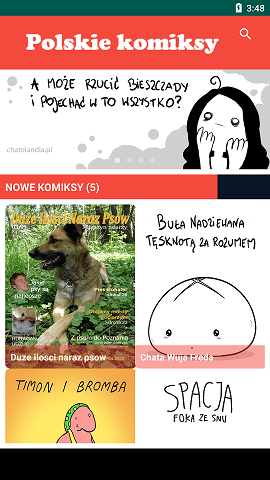
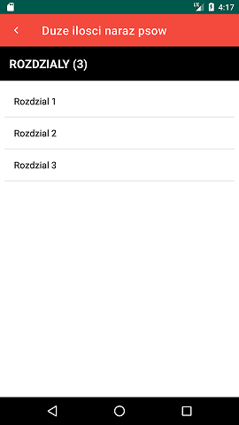
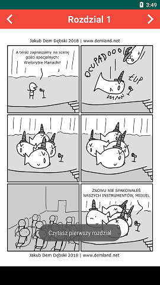
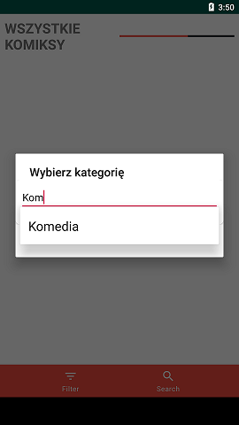
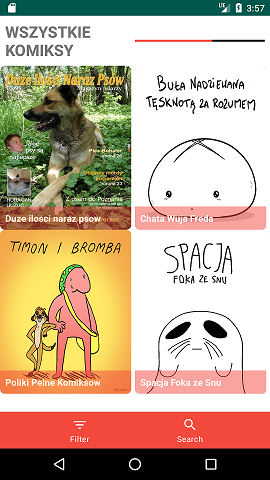
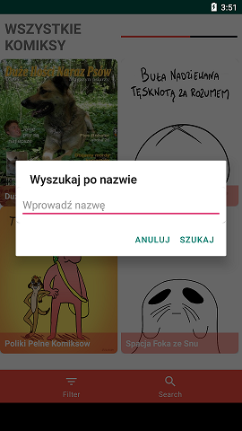

# ComicalApp
Android app for exploring polish comics - both modern webcomics and classic ones.

## Table of contents
* [General info](#general-info)
* [Screenshots](#screenshots)
* [Technologies](#technologies)
* [Setup](#setup)
* [Features](#features)
* [Project status](#project-status)

## General info


ComicalApp is a university project for Android. This app allows users to access best comics by polish writers found on the web. Each comic is divided into seasons/chapters, and the user can easily navigate the pages by swiping - just like a regular e-book. Cloud database containing the images has been set up on Google Firebase for easy and quick access to the pages. In addition, various libraries were used for a smoother reader's experience.

## Screenshots













## Technologies

* Android studio
* Firebase core
* Firebase database
* PhotoView - Implementation of ImageView for Android that supports zooming, by various touch gestures
* Square Picasso - Image loading and transformation tool 
* Banner-Slider - Library used for sliding banners at the top of home page
* EasyFlipViewPager - Page flip animations in ViewPager 

## Setup 

For launching the app, download the repository and open it with Android Studio (3.5.3 or higher). All additional libraries and necessary files should be automatically downoladed with the project.

## Features 
List of completed features and views include: 

* Connection to Firebase 
* Splash screen
* Home page with comics list
* Comics banners
* List of chapters upon clicking a comic
* Navigation between pages/chapters, with error messages displaying when there are no more chapters to display
* Filters - a comic can be searched by category (Komedia, Akcja, Psychologiczny, Przygodowy, Sci fi, Fantastyka)
* Search - a comic can be searched by name (or part of the name)


## Project status

Basic functionalities and front-end were completed, although the layout needs tweaking. For the time being the app has 5 different comics to choose from - for it to serve its purpose a greater variety is required. There were additional, unused categories created, which can be filled out while adding new comics.  

## Code examples

View comic activity

```java
// view comic activity

public class ViewComicActivity extends AppCompatActivity {

    ViewPager viewPager;
    TextView txt_chapter_name;
    View back,next;

    @Override
    protected void onCreate(Bundle savedInstanceState) {
        super.onCreate(savedInstanceState);
        setContentView(R.layout.activity_view_comic);

        viewPager = (ViewPager)findViewById(R.id.view_pager);
        txt_chapter_name = (TextView)findViewById(R.id.txt_chapter_name);
        back = findViewById(R.id.chapter_back);
        next = findViewById(R.id.chapter_next);

        back.setOnClickListener(new View.OnClickListener() {
            @Override
            public void onClick(View view) {
                if(Common.chapterIndex == 0)
                    Toast.makeText(ViewComicActivity.this, "Czytasz pierwszy rozdzial", Toast.LENGTH_SHORT).show();
                else
                {
                    Common.chapterIndex--;
                    fetchLinks(Common.chapterList.get(Common.chapterIndex));
                }

            }
        });
        next.setOnClickListener(new View.OnClickListener() {
            @Override
            public void onClick(View view) {
                if(Common.chapterIndex == Common.chapterList.size()-1)
                    Toast.makeText(ViewComicActivity.this, "Czytasz ostatni rozdzial", Toast.LENGTH_SHORT).show();
                else
                {
                    Common.chapterIndex++;
                    fetchLinks(Common.chapterList.get(Common.chapterIndex));
                }

            }
        });
        fetchLinks(Common.chapterSelected);

    }

    private void fetchLinks(Chapter chapter) {
        if(chapter.Links != null)
        {
            if(chapter.Links.size() > 0)
            {
                MyViewPagerAdapter adapter = new MyViewPagerAdapter(getBaseContext(),chapter.Links);
                viewPager.setAdapter(adapter);

                txt_chapter_name.setText(Common.formatString(Common.chapterSelected.Name));

                //animacja!!

                BookFlipPageTransformer bookFlipPageTransformer = new BookFlipPageTransformer();
                bookFlipPageTransformer.setScaleAmountPercent(10f);
                viewPager.setPageTransformer(true,bookFlipPageTransformer);


            }
            else {
                Toast.makeText(this,"Brak obrazu", Toast.LENGTH_SHORT).show();
            }

        }
        else {
            Toast.makeText(this,"Rozdział się ładuje...",Toast.LENGTH_SHORT).show();
        }

    }
}
```

Search comic by name
```java
  private void showSearchDialog() {
        AlertDialog.Builder alertDialog = new AlertDialog.Builder(FilterSearchActivity.this);
        alertDialog.setTitle("Wyszukaj po nazwie");

        final LayoutInflater inflater = this.getLayoutInflater();
        View search_layout = inflater.inflate(R.layout.dialog_search,null);

        final EditText edt_search = (EditText)search_layout.findViewById(R.id.edt_search);

        alertDialog.setView(search_layout);
        alertDialog.setNegativeButton("ANULUJ", new DialogInterface.OnClickListener() {
            @Override
            public void onClick(DialogInterface dialogInterface, int i) {
                dialogInterface.dismiss();

            }
        });
        alertDialog.setPositiveButton("SZUKAJ", new DialogInterface.OnClickListener() {
            @Override
            public void onClick(DialogInterface dialogInterface, int i) {
                fetchSearchComic(edt_search.getText().toString());

            }
        });

        alertDialog.show();

    }

    private void fetchSearchComic(String query) {
        List<Comic> comic_search = new ArrayList<>();
        for(Comic comic:Common.comicList)
        {
            if(comic.Name.contains(query))
                comic_search.add(comic);
        }
        if(comic_search.size() > 0)
            recycler_filter_search.setAdapter(new MyComicAdapter(getBaseContext(),comic_search));
        else
            Toast.makeText(this,"Nie znaleziono :(",Toast.LENGTH_SHORT).show();
    }
```


